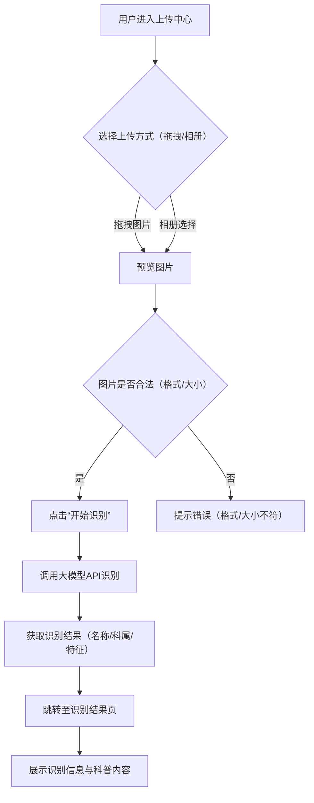
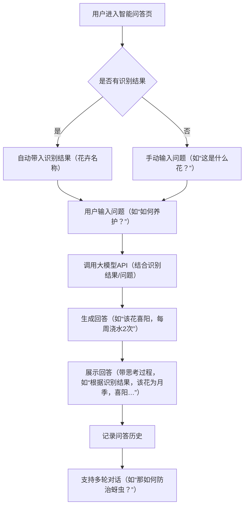
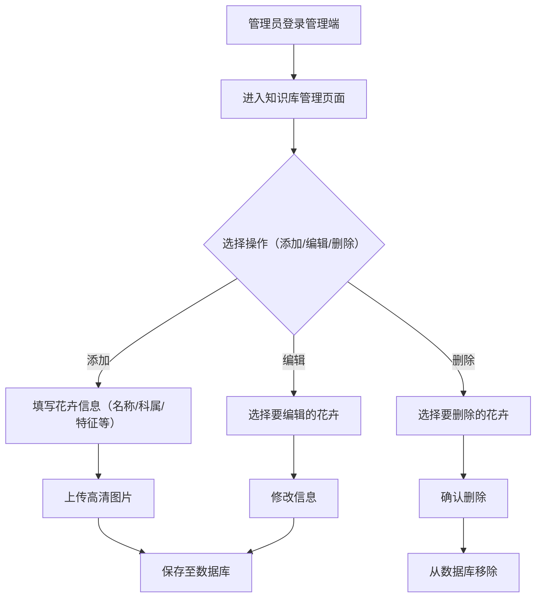

### 基于大模型的智能花卉识别与科普系统：信息架构设计

#### **一、站点地图（Sitemap）**

站点地图采用**双角色分层架构**，区分**用户端**（普通用户、园艺爱好者、景区导览员）和**管理端**（系统管理员、知识库编辑），清晰梳理页面层级与导航关系。

##### **1. 用户端站点地图**

用户端是系统的核心交互入口，聚焦“识别-科普-问答”核心流程，同时支持历史记录与个人管理。

```plaintext
用户端
├─ 首页（ landing page ）
│  ├─ 核心功能入口（图片上传、热门花卉推荐、快速问答）
│  └─ 导航栏（首页、上传中心、科普知识库、智能问答、历史记录、个人中心）
├─ 上传中心
│  ├─ 图片上传（拖拽/相册选择，支持JPG/PNG格式）
│  ├─ 上传预览（实时显示选中图片，支持删除）
│  └─ 上传提示（格式/大小限制说明）
├─ 识别结果页
│  ├─ 图片展示（原图+识别标记，如 bounding box）
│  ├─ 识别信息（花卉名称、科属分类、特征描述、置信度）
│  ├─ 科普内容（生长习性、养护方法、花语文化，支持Markdown渲染）
│  └─ 延伸操作（收藏花卉、分享结果、发起问答）
├─ 科普知识库
│  ├─ 分类浏览（按科属、花色、花期等维度筛选）
│  ├─ 搜索栏（关键词搜索，支持模糊匹配）
│  ├─ 花卉详情页（同识别结果页的科普内容，增加更多图片/视频）
│  └─ 热门推荐（根据用户浏览记录推荐相关内容）
├─ 智能问答页
│  ├─ 对话窗口（支持文本输入、图片上传）
│  ├─ 历史对话（按时间排序，支持回溯）
│  ├─ 问答提示（常见问题引导，如“如何防治红蜘蛛？”）
│  └─ 多轮对话（结合识别结果，支持上下文关联）
├─ 历史记录页
│  ├─ 识别记录（按时间排序，显示图片缩略图、识别结果）
│  ├─ 问答记录（按对话分组，显示问题与回答摘要）
│  └─ 操作（删除记录、导出Excel）
└─ 个人中心
   ├─ 个人信息（头像、昵称、手机号，支持修改）
   ├─ 我的收藏（收藏的花卉列表，支持批量取消）
   ├─ 设置（通知开关、隐私设置、主题切换）
   └─ 退出登录
```

##### **2. 管理端站点地图**

管理端面向系统运维与知识库管理，聚焦“数据维护-用户管理-统计分析”，确保系统内容与权限的可控性。

```plaintext
管理端
├─ 登录页（账号密码登录，支持验证码）
├─ 仪表盘（核心数据概览：总用户数、今日识别量、热门花卉TOP5）
├─ 知识库管理
│  ├─ 花卉列表（表格展示，支持按名称/科属筛选）
│  ├─ 添加花卉（表单输入：名称、科属、特征、养护方法等）
│  ├─ 编辑花卉（支持修改已有信息，上传高清图片）
│  ├─ 删除花卉（二次确认，防止误操作）
│  └─ 批量操作（导入Excel、导出数据、批量删除）
├─ 用户管理
│  ├─ 用户列表（表格展示，支持按角色/注册时间筛选）
│  ├─ 角色分配（普通用户、园艺爱好者、管理员，支持权限调整）
│  ├─ 禁用用户（冻结违规账号，支持恢复）
│  └─ 操作日志（记录用户登录、修改信息等行为）
├─ 识别记录管理
│  ├─ 记录列表（按时间/用户筛选，显示图片、识别结果）
│  ├─ 统计分析（识别量趋势图、热门花卉占比、错误率统计）
│  └─ 导出数据（支持CSV/Excel格式）
└─ 系统设置
   ├─ 大模型配置（API密钥管理、模型选择：通义千问/DeepSeek）
   ├─ 通知设置（系统公告、用户反馈提醒）
   └─ 日志管理（系统异常日志、操作日志，支持下载）
```

#### **二、线框图与流程图**

线框图聚焦“功能布局与交互逻辑”，流程图聚焦“用户操作路径”，两者结合清晰呈现系统的信息架构与用户 journey。

##### **1. 核心页面线框图**

###### **（1）上传中心页面**

- **布局**：顶部为标题“上传花卉图片”，中间为拖拽区域（占页面60%），底部为操作按钮（“选择图片”“开始识别”）。
- **交互**：
  - 拖拽图片至区域，实时显示预览图（带删除按钮）；
  - 点击“选择图片”，调用系统文件选择器（支持JPG/PNG，限制5MB以内）；
  - 上传完成后，“开始识别”按钮激活，点击后跳转至识别结果页。
- *异常处理**：
  - 上传非图片文件，提示“请上传JPG/PNG格式的图片”；
  - 图片大小超过5MB，提示“图片过大，请压缩后上传”。

###### **（2）识别结果页**

- **布局**：左侧为原图（占40%，带识别标记），右侧为识别信息（占60%），底部为科普内容与操作按钮。
- **信息分层**：
  - 一级信息：花卉名称（大字体，加粗）、科属分类（小字，灰色）；
  - 二级信息：特征描述（如“花瓣5枚，呈星形”）、置信度（如“识别准确率：95%”）；
  - 三级信息：科普内容（生长习性、养护方法，支持折叠/展开）。
- **操作**：
  - 点击“收藏”，将花卉添加至个人中心的“我的收藏”；
  - 点击“分享”，生成二维码（支持微信/微博分享）；
  - 点击“发起问答”，跳转至智能问答页（自动带入识别结果）。

###### **（3）管理端-知识库列表页**

- **布局**：顶部为搜索栏（“请输入花卉名称/科属”），中间为表格（列：名称、科属、创建时间、操作），底部为分页组件。
- **交互**：
  - 输入关键词，实时筛选表格内容（支持模糊匹配）；
  - 点击“添加花卉”，弹出表单模态框（包含名称、科属、特征等字段）；
  - 点击“编辑”，跳转至编辑页面（预填充原有信息）；
  - 点击“删除”，弹出确认框（“确定删除该花卉？”），确认后删除。

##### **2. 核心用户流程图**

###### **（1）图片识别流程（用户端）**



###### **（2）智能问答流程（用户端）**



###### **（3）知识库管理流程（管理端）**



#### **三、设计说明**

1. **用户角色适配**：
   - 普通用户：聚焦“快速识别”与“基础科普”，界面简洁，操作路径短；
   - 园艺爱好者：增加“收藏”“历史记录”“深度问答”功能，满足专业需求；
   - 景区导览员：支持“多语言问答”（如英文），界面增加“分享”功能，方便传播；
   - 管理员：强调“批量操作”与“统计分析”，提升管理效率。
2. **交互逻辑优化**：
   - 上传中心采用“拖拽+预览”设计，减少用户操作步骤；
   - 识别结果页采用“左图右文”布局，符合用户“先看图再看信息”的习惯；
   - 智能问答页增加“历史对话”与“问题提示”，降低用户思考成本。
3. **扩展性考虑**：
   - 站点地图预留“AR识别”“社区交流”等二期功能入口；
   - 线框图采用“模块化设计”，如“科普内容”组件可在“识别结果页”与“知识库详情页”复用；
   - 流程图预留“批量识别”“多模态输入（如语音）”等扩展点，支持未来功能迭代。